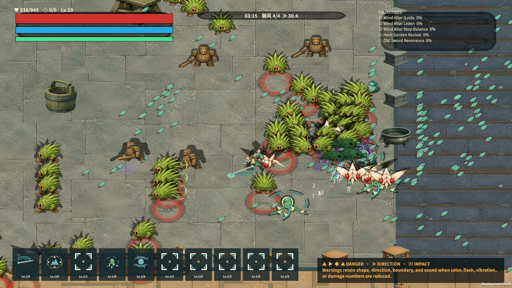
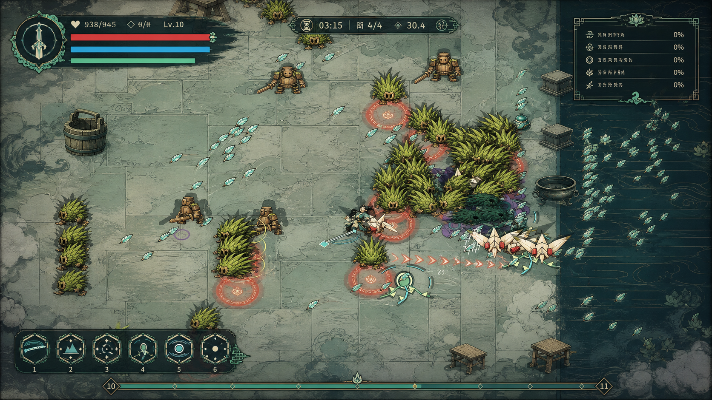

# G4.2-A「青瓷剑境」Style Bible

- 状态：`DIRECTION CANDIDATE / NOT RELEASE APPROVED`
- 适用范围：G4.2-A 90 秒垂直样板
- 日期：2026-08-12
- 约束来源：`Docs/DemoDevelopment/31_G4_2_VISUAL_QUALITY_OPTIMIZATION_PLAN.md`

## 1. 目标

“青瓷剑境”不是给旧画面增加更多装饰，而是建立一套可执行的信息层级：玩家、危险、目标在一秒内可辨；
UI、地面、角色与 VFX 使用同一套墨线、青瓷、米白和朱砂语言；高密度战斗仍保留中央净区。

本 Style Bible 只批准 G4.2-A 样板方向。六敌、两 Boss、五区地面和全页面批量重制仍在范围外，必须等
独立人类方向签字和可读性 Rubric 达到 80/100 后再开始。

## 2. 视觉原则

1. **墨定轮廓**：角色、卡片与危险边缘都以深墨轮廓建立形状，不依赖颜色单通道。
2. **青瓷定交互**：青玉色只用于玩家、可交互、进度和正向反馈；不可成为大面积背景噪声。
3. **朱砂定危险**：朱砂只用于即将造成伤害的 Telegraph、致命警告和受击瞬间。
4. **米白定正文**：正文和关键数值使用米白；金色只标记稀有、完成和阶段节点。
5. **纸纹降噪**：地面使用低频手绘纹理、软边墨晕和 Decal，禁止直线生硬分区。
6. **中心留白**：屏幕中央 45% × 45% 不放常驻 UI；战斗密度不能由拾取物和数字占满。

## 3. Canonical Theme Tokens

| Token | Hex | 唯一职责 |
|---|---|---|
| `Ink-950` | `#102A2D` | 最深背景、轮廓、遮罩 |
| `Ink-800` | `#1C4243` | 面板、次级边缘、暗部 |
| `Jade-500` | `#42B8AD` | 交互、进度、玩家识别 |
| `Jade-200` | `#A9E5D8` | 高光、焦点、辅助边缘 |
| `Rice-100` | `#F2EBD8` | 正文、关键图标、明部 |
| `Gold-400` | `#D7B55A` | 稀有、完成、阶段节点 |
| `Cinnabar-500` | `#E4573D` | 危险主体、重击 |
| `Cinnabar-300` | `#FF8B62` | 危险前沿、警告脉冲 |
| `Void-700` | `#563C76` | Boss/异常机制，不与普通危险混用 |

`Game.UI.QinglanUiTheme` 与 `Game.Presentation.QinglanPresentationTheme` 分别镜像这些 Token。之所以不建立
新的共享程序集，是为了保持 ADR 0031 的依赖方向；EditMode 测试负责阻止两侧漂移。

## 4. 字体与信息层级

- 1080p 正文默认不低于 18 px；关键数值 20—24 px；卡片标题 24 px。
- 正文使用已登记 Noto Sans CJK，叙事标题可使用已登记 Narrative 字体；不新增字体。
- 1080p 默认对比至少 4.5:1，大字至少 3:1；High Contrast 目标 7:1。
- 信息顺序固定为：当前危险 → 玩家生存 → 当前目标 → 时间/阶段 → 构筑详情。
- 省略低频重复说明；危险图例只在教学或设置预览中出现，不再常驻战斗右下角。

## 5. HUD 样板

| 区域 | 1080p 预算 | 规则 |
|---|---:|---|
| 左上生存 | 最大 `360 × 96` | 生命与护盾分层；数值在条上方；不占 1/3 屏宽 |
| 顶部状态 | 最大 `420 × 52` | 时间、御风档位、Boss/波次择要显示 |
| 右上目标 | 最大 `360 × 150` | 1 个主目标 + 最多 2 个次目标 |
| 左下构筑 | 6 个核心槽 | 64—72 px 图标；其余通过展开页查看 |
| 底部经验 | 高 12—18 px | 单条全宽细线，等级节点可见 |
| 中央净区 | 屏幕 45% × 45% | 禁止常驻 UI、说明面板和大面积数字 |

面板默认使用 `Ink-950` 88% 透明度、1—2 px `Jade-200`/金色结构边。选中态必须同时改变边线、角标和
轻微亮度，不能只换颜色。

## 6. 升级三卡与设置样板

- Level-up / Reward 固定为横向三卡；每卡必须含图标、名称、目标等级、行为说明、类型标签和构筑关系。
- 默认焦点位于中卡或 Presenter 指定项；鼠标、键盘、手柄进入同一 Command。
- 选中态只允许 1.02—1.04 倍缩放和 120—180 ms 呼吸，不使用大幅漂浮。
- Pause/Settings 在同一画面实时预览字体缩放、色觉、高对比、Reduce Motion 和危险形状。
- 150% 字体时优先增加卡高与面板安全区，不把正文字号自动压回 18 px 以下。

## 7. 世界、角色与道具

- 样板视野只覆盖中央 24 × 24 m 演武区和一条软过渡边界。
- Base 地面提供低频青灰石纹；Edge 用破碎笔触和墨晕；Decal 控制局部纸纹和磨损。
- 道具仅使用现有六类中的三类，组成前景、中景、地标三档，不沿网格平均撒布。
- 玩家轮廓最强，使用 `Ink-950` 外轮廓 + `Jade-200` 局部 rim；群体中不得被同亮度敌人吞没。
- 草灵以叶冠剪影和暖木面区分；木剑傀儡以竖直桶身、横向木剑和金属节点区分。
- 游风剑持续可见，但亮度和拖尾面积低于危险前沿；不能冒充敌方 Telegraph。

## 8. 战斗反馈

| 层级 | 用途 | 形状 / 时间 |
|---|---|---|
| V0 | 玩家、致命危险、Boss 核心机制 | 实边 + 低透明填充 + 方向符号；全程清晰 |
| V1 | 普通命中、重击、技能主反馈 | 80—220 ms，重击比普通命中更大、更暖、更慢 |
| V2 | 掉落、状态、非关键技能 | 密度高时降频或合批 |
| V3 | 环境尘、叶、装饰 | Reduce Motion 或压力档首先关闭 |

- 圆形 Telegraph：朱砂低透明填充、破碎亮边、中心形状标记。
- 直线 Telegraph：方向轴 + 箭头/缺口，不能只画一条红色矩形。
- 伤害数字同目标 120 ms 内聚合；拾取物超过 32 个时进入表现聚类，不改变模拟实体。
- Reduce Motion 关闭震屏、装饰粒子和大幅缩放，但保留危险边界、命中停顿和音频通道。

## 9. 概念帧与边界

当前实机基线：

目标方向帧：

目标帧由项目自己的 Development Player 截图生成，仅用于方向、层级和构图讨论；其中不可读的伪文字、
推测性装饰和未在游戏中实现的细节不得直接进入 Runtime 或 Release。提示词与来源见
`concept-prompt.txt`、`concept-provenance.json`。

## 10. G4.2-A 审查矩阵

- 同 Seed：0 / 15 / 30 / 45 / 60 / 90 秒 Before/After。
- 页面：Run HUD、升级三卡、Pause、Settings 实时预览。
- 模式：默认、去色、Protanopia、Deuteranopia、Tritanopia、High Contrast、Reduce Motion、150% 字体。
- 分辨率：G4.2-A 首轮 1920×1080；G4.2-B 再扩至 720p / 1440p / 4K / 21:9 / 200%。
- 人工 Rubric：玩家/危险/目标 25、风格 20、信息 15、命中 15、世界 10、可访问性 10、品牌 5。
- 退出门禁：总分至少 80/100 且任一维度不低于其满分的 60%；必须有独立人类签字。

## 11. 禁止项

- 不复制、描摹或提取参考游戏、开源项目或未知来源的 UI、角色、VFX、Prefab、Scene、Logo 和音频。
- 不用更多 Bloom、震屏、全屏粒子或饱和度掩盖层级问题。
- 不以资产数量、VFX Spawn 数或概念帧观感代替真实 Player 截图和人工审查。
- 未签字前不批量生产全 UI、五区、六敌和两 Boss。
